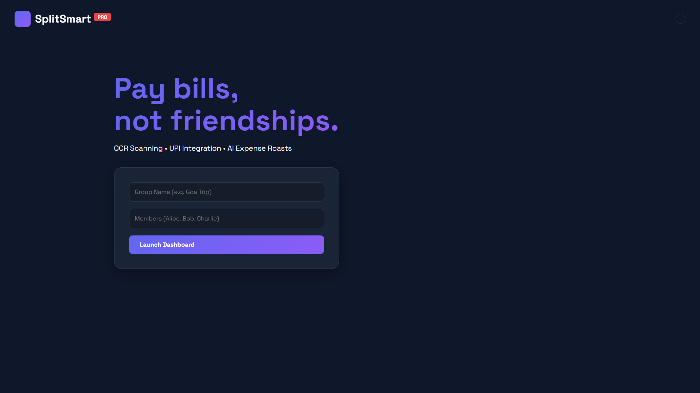
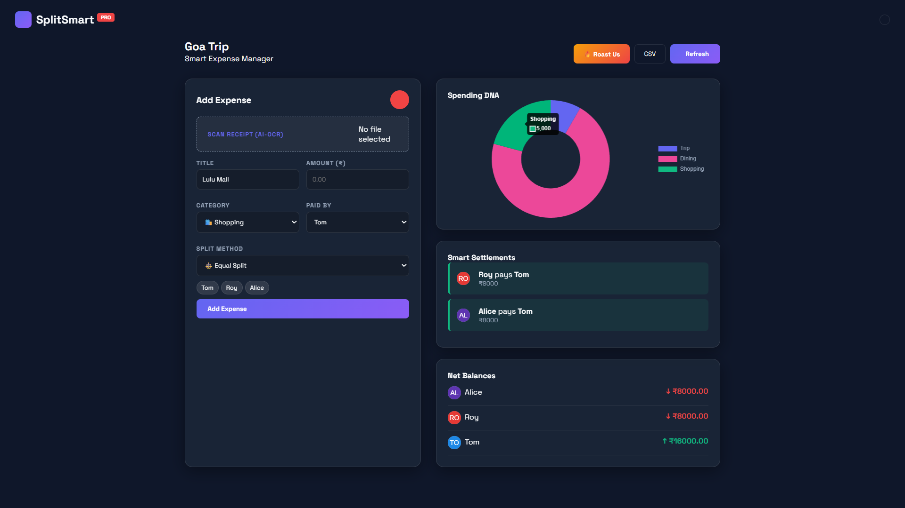
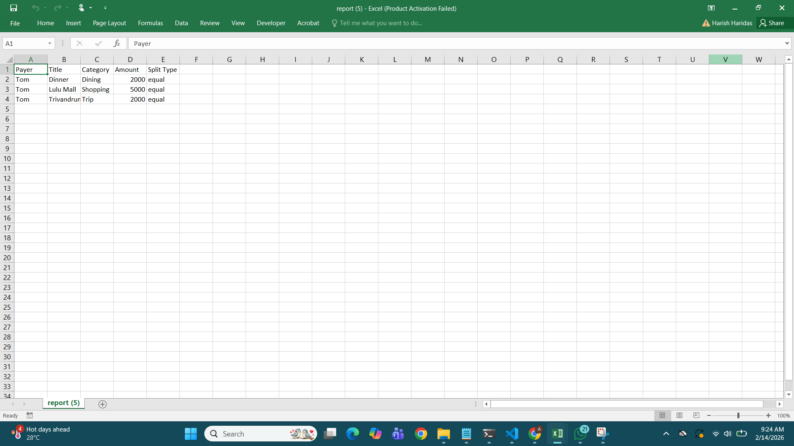

# SplitSmart 

An AI-powered expense manager that removes the social friction and math headaches of splitting bills in a group — scan a receipt, and it handles the rest.

## The Problem

Splitting bills in a group (trips, flatmates, dinners) is broken in three ways:
1. **Manual entry is tedious** — typing out every line item from a receipt is slow and error-prone.
2. **Settlements get tangled** — in a group of 5+, "who owes whom" turns into a web of circular debts.
3. **Asking for money is awkward** — which means debts often just don't get settled.

## The Solution

SplitSmart automates the full lifecycle of a shared expense:
1. **Scan** — take a photo of a bill; a Tesseract-based OCR pipeline extracts the total automatically.
2. **Optimize** — a "minimize cash flow" greedy algorithm collapses circular debts (if A owes B ₹50 and B owes C ₹50, it tells A to pay C directly instead), cutting the number of transactions needed by up to 60%.
3. **Settle** — generates a dynamic UPI QR code so the actual payment can happen instantly via GPay/PhonePe/Paytm.

## Features

- **AI-powered OCR scanning** — image preprocessing (grayscale conversion, contrast enhancement, sharpening) plus regex pattern matching designed to extract totals automatically from receipt photos. *(Note: automatic price extraction is not currently working reliably in the deployed version — see Known Limitations below.)*
- **Debt simplification algorithm** — a greedy algorithm that repeatedly settles the largest creditor against the largest debtor, minimizing total transaction volume.
- **UPI QR generation** — generates a scannable UPI QR code per settlement (currently using placeholder demo IDs — see Known Limitations).
- **Spending analytics** — category-wise spending breakdown and exportable CSV transaction reports.
- **Social/gamified touches** — an "AI Roast" of the group's spending habits and a pre-filled "nag" reminder for unpaid debts.

## Tech Stack

**Backend:** Python, Flask, Flask-CORS
**AI/OCR:** pytesseract, Pillow (image preprocessing)
**Frontend:** JavaScript, HTML5/CSS3, Chart.js (analytics), qrcode.js (UPI QR), canvas-confetti
**Tools:** VS Code, Git/GitHub, Tesseract-OCR (system dependency)

## Running locally

```bash
git clone https://github.com/AnamikaHarish/snap-test.git
cd snap-test
pip install -r requirements.txt
python app.py
```

**Live demo:** https://snap-test-q68s.onrender.com/

## Known limitations

- **OCR auto-scan is not working in the current deployed build** — bill photo upload works, but automatic price extraction doesn't fire reliably in production. Manual amount entry is available and fully functional as a fallback.
- **UPI QR codes currently use placeholder demo data** (`example@upi`), not real per-user UPI IDs — the backend doesn't yet collect actual payment addresses from members, so the QR generation mechanism works and is scannable, but isn't wired up for real payments yet.
- Everything downstream of expense entry — debt-settlement splitting, spending graphs, and CSV export — is confirmed working on the live deployment.

## Screenshots





**Demo video:** [docs/demo.mp4](docs/demo.mp4)

## Team

Built at a TinkerHub hackathon by team **Obsidians**.
- Anamika H — LBS Institute of Technology for Women (OCR pipeline, debt-settlement algorithm, backend (Flask), deployment)
- Anaswara Shajee — LBS Institute of Technology for Women (Joint ideation and UI feedback)

---
Made with ❤️ at TinkerHub
